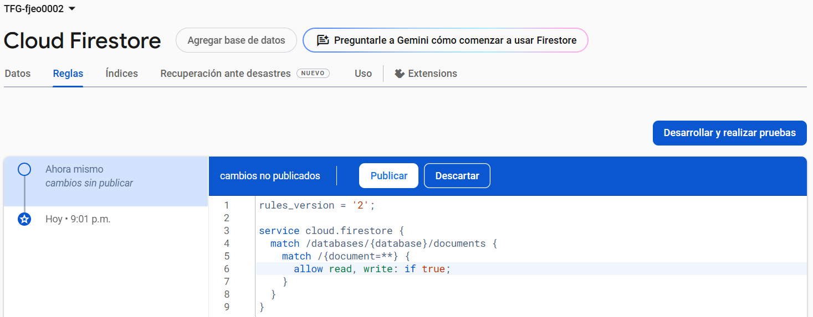
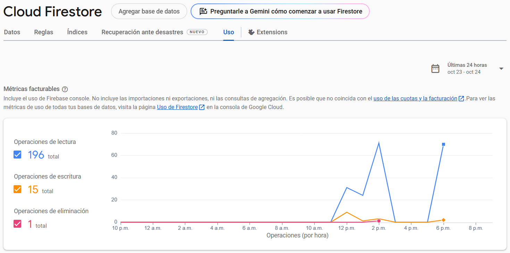

# NetBeans20 + Firebase

> *Un pequeño paso para el hombre, pero un gran salto para la humanidad*
**Neil Armstrong**

Comencemos por gestionar la BBDD con Firebase

## Firebase

Googleamos “Firebase” y entramos en el primer enlace. 


Vamos a seleccionar la cuenta TIC de la UJA y pichamos en “Comenzar”


Pulsamos en “+ Crear un proyecto” e ingresamos el nombre de tu proyecto.


En el siguiente paso, en mi caso no habilitaré Google Analytics dado que es una extensión más de Google que, aunque facilite registros, informes y orientación… prefiero focalizarme en gestionar mi propia base de datos a pequeña escala

Creamos el proyecto y automáticamente nos dirigimos a la consola de Firebase, es decir, la página principal:


Hay infinidad de opciones y todas seguramente muy útiles para nuestro proyecto. En principio, vamos a crear la BBDD en “Compilación >> Firestore Database >> Crear base de datos”

Establecemos la ubicación más cercana y el nombre por defecto:


Definimos las reglas de seguridad. Más tarde se podrán cambiar si queremos hacer pruebas, por ello yo la dejo en producción.


Nuestra BBDD ya está creada, y se monitorizará dentro de esta sección:


Si queremos agregar una tabla solo hay que darle a “+ Iniciar colección” y damos un nombre a la tabla. Por cada tabla podrás incluir “Documentos” que serán cada una de las duplas de la tabla, identificados por ese documento como clave primaria. Ya sólo quedará ingresar tantos valores como columnas tenga nuestra tabla e ir rellenando los campos.

Como hemos comentado, podemos cambiar de modo producción a modo desarrollo (prueba) en la BBDD. Para ello, iremos a “Reglas” y únicamente, cambiamos el “false” del código por un “true” y Publicamos los cambios.



Por último, para monitorizar las operaciones que se hacen desde nuestra BBDD vamos a “Uso” y con una gráfica nos mostrará todo lo que, en 24h, se ha realizado.



Es importante recalcar que, no podemos sobrepasar las operaciones por más de 20.000 cada una por día. En ese caso, empezarán a cobrar por el servicio.

Más adelante, se irá definiendo la BBDD que usaré y, en su caso, explicar cómo la he creado y lo necesario para que funcione correctamente.

## Netbeans IDE 20

Es hora de probar nuestra BBDD con Netbeans20. Tras instalarlo desde la página oficial, con el SDK de java 17 (mayor compatibilidad demostrada con proyectos durante todo el grado) crearemos un nuevo proyecto


Seleccionamos “Java with Maven >> Java Application”


Ponemos nombre a nuestro proyecto y el package correspondiente


Ya creado, añadiremos las dependencias necesarias para que podamos conectarnos con Firebase haciendo las siguientes tareas.

1. Actualizar el “pom.xml” añadiendo el siguiente código:

```jsx
<dependencies>
        <!-- https://mvnrepository.com/artifact/com.google.firebase/firebase-admin -->
        <dependency>
            <groupId>com.google.firebase</groupId>
            <artifactId>firebase-admin</artifactId>
            <version>9.4.1</version>
        </dependency>
    </dependencies>
```

Se añadirán automáticamente las dependencias necesarias para la compilación

2. Descargar de Firebase el archivo de claves de cuenta de servicio
- **Descargar el archivo correcto de claves de cuenta de servicio (Service Account Key):**
    - Ve a la consola de Firebase:
        - Accede a Firebase Console.
        - Selecciona tu proyecto.
        - En el menú de la izquierda, selecciona **Project Settings** (Configuración del proyecto).
        - Ve a la pestaña **Service Accounts** (Cuentas de servicio).
        - Haz clic en **Generate New Private Key** (Generar nueva clave privada) con Java seleccionado


Se descargará un archivo `.json` con las credenciales correctas para usar con el SDK de administración de Firebase.

- **Colocar el archivo en tu proyecto:**
    - Guarda el archivo `.json` que descargaste en la carpeta raíz de tu proyecto (o cualquier otra ruta que prefieras, pero asegúrate de especificar esa ruta correctamente en tu código más tarde).
3. Crear Clases para la conexión con la BBDD

```jsx
import com.google.auth.oauth2.GoogleCredentials;
import com.google.firebase.FirebaseApp;
import com.google.firebase.FirebaseOptions;
import com.google.cloud.firestore.Firestore;
import com.google.firebase.cloud.FirestoreClient;

import java.io.FileInputStream;
import java.io.IOException;

public class FirebaseInitializer {
    private Firestore db;

    public FirebaseInitializer() throws IOException {
        // Cargar el archivo de credenciales JSON de la cuenta de servicio
        FileInputStream serviceAccount = new FileInputStream("<archivo-descargado>.json");

        FirebaseOptions options = new FirebaseOptions.Builder()
                .setCredentials(GoogleCredentials.fromStream(serviceAccount))  // Usar GoogleCredentials
                .build();

        // Inicializar la app Firebase
        FirebaseApp.initializeApp(options);
        this.db = FirestoreClient.getFirestore();
    }

    public Firestore getDb() {
        return db;
    }
}
```

Ahora, al crear un objeto “FirebaseInitializer” desde cualquier punto (en un principio) del código en Netbeans, podrás acceder a tu BBDD.

**Opcionalmente:** yo he incluido un pequeño ejemplo de una tabla llamada “Usuarios” con nombre, email y edad que hace operaciones CRUD.

```jsx
import com.google.api.core.ApiFuture;
import com.google.cloud.firestore.DocumentReference;
import com.google.cloud.firestore.DocumentSnapshot;
import com.google.cloud.firestore.Firestore;
import com.google.cloud.firestore.WriteResult;
import java.util.HashMap;
import java.util.Map;

/**
 *
 * @author jota
 */
public class UsuarioCRUD {
    public void crearUsuario(Firestore db, String id, String nombre, String email, int edad) {
        Map<String, Object> usuario = new HashMap<>();
        usuario.put("nombre", nombre);
        usuario.put("email", email);
        usuario.put("edad", edad);

        // Agregar el documento a la colección "Usuarios"
        ApiFuture<WriteResult> future = db.collection("Usuarios").document(id).set(usuario);

        try {
            // Espera a que se complete la operación
            WriteResult result = future.get();
            System.out.println("Usuario creado con ID: " + id + ", en: " + result.getUpdateTime());
        } catch (Exception e) {
            System.out.println("Error al agregar el usuario: " + e.getMessage());
        }
    }

    public void leerUsuario(Firestore db, String id) {
        DocumentReference docRef = db.collection("Usuarios").document(id);

        ApiFuture<DocumentSnapshot> future = docRef.get();

        try {
            DocumentSnapshot documentSnapshot = future.get();
            if (documentSnapshot.exists()) {
                System.out.println("Usuario encontrado: " + documentSnapshot.getData());
            } else {
                System.out.println("Usuario no encontrado");
            }
        } catch (Exception e) {
            System.out.println("Error al leer el usuario: " + e.getMessage());
        }
    }

    public void actualizarUsuario(Firestore db, String id, String nuevoNombre, String nuevoEmail, Integer nuevaEdad) {
        DocumentReference docRef = db.collection("Usuarios").document(id);

        // Crea un mapa con los nuevos valores
        Map<String, Object> actualizaciones = new HashMap<>();
        if (nuevoNombre != null) actualizaciones.put("nombre", nuevoNombre);
        if (nuevoEmail != null) actualizaciones.put("email", nuevoEmail);
        if (nuevaEdad != null) actualizaciones.put("edad", nuevaEdad);

        ApiFuture<WriteResult> future = docRef.update(actualizaciones);

        try {
            WriteResult result = future.get();
            System.out.println("Usuario actualizado con ID: " + id + ", en: " + result.getUpdateTime());
        } catch (Exception e) {
            System.out.println("Error al actualizar el usuario: " + e.getMessage());
        }
    }

    public void eliminarUsuario(Firestore db, String id) {
        DocumentReference docRef = db.collection("Usuarios").document(id);

        ApiFuture<WriteResult> future = docRef.delete();

        try {
            WriteResult result = future.get();
            System.out.println("Usuario eliminado con ID: " + id + ", en: " + result.getUpdateTime());
        } catch (Exception e) {
            System.out.println("Error al eliminar el usuario: " + e.getMessage());
        }
    }
}
```

Creamos también un pequeño Main de apoyo para probar la conexión. 

```jsx
public class Main {
    public static void main(String[] args) {
        try {
            FirebaseInitializer firebaseInitializer = new FirebaseInitializer();
            Firestore db = firebaseInitializer.getDb();

            // Crear un nuevo usuario
            crearUsuario(db, "user1", "Ana", "ana@example.com", 30);

            // Leer un usuario
            leerUsuario(db, "user1");

            // Actualizar el usuario
            actualizarUsuario(db, "user1", "Ana Pérez", null, 31);

            // Leer el usuario actualizado
            leerUsuario(db, "user1");

            // Eliminar el usuario
            eliminarUsuario(db, "user1");

            // Intentar leer el usuario eliminado
            leerUsuario(db, "user1");

        } catch (IOException e) {
            System.out.println("Error inicializando Firebase: " + e.getMessage());
        }
    }

    // Métodos CRUD (crearUsuario, leerUsuario, actualizarUsuario, eliminarUsuario) van aquí
}
```

Al ejecutar, vemos como desde Firebase, los datos se están actualizando en la tabla.