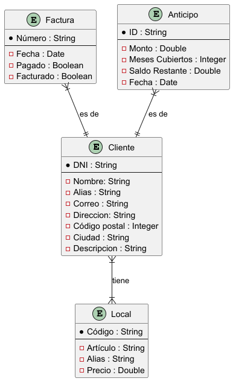
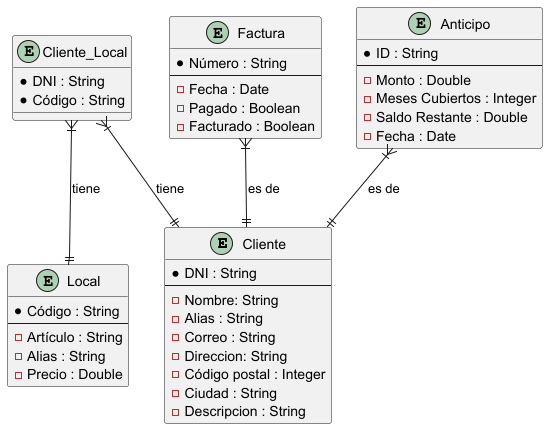

# Definición de la base de datos

> *«Los datos! ¡Los datos! Los datos! «, gritó con impaciencia. «No puedo hacer ladrillos sin arcilla!»*
**Sherlock Holmes**
> 

El diseño de base de datos propuesto permite gestionar toda la información que tendremos en cuenta. La estructura inicial se representa mediante un **Diagrama Entidad-Relación (E-R)**, el cual pasará a un **Diagrama Entidad-Relación Modificado (E-R Modificado)** para mejorar la normalización y las relaciones. Este diseño asegura la integridad de los datos y simplifica la gestión de asociaciones entre entidades.

A continuación, se describen las entidades y atributos definidos en el **Diagrama Entidad-Relación (E-R)**, junto con su significado y propósito.



---

### Entidades y Atributos

### 1. **Cliente**

Representa a las personas o empresas registradas en el sistema.

- **DNI (Clave primaria):** Identificador único del cliente.
- **Nombre:** Nombre completo del cliente.
- **Alias:** Apodo o nombre alternativo del cliente.
- **Correo:** Dirección de correo electrónico.
- **Dirección:** Domicilio físico del cliente.
- **Código postal:** Código asociado a la ubicación del cliente.
- **Ciudad:** Nombre de la ciudad donde reside el cliente.
- **Descripción:** Observaciones adicionales sobre el cliente.

---

### 2. **Local**

Contiene información sobre los locales registrados en el sistema.

- **Código (Clave primaria):** Identificador único del local.
- **Artículo:** Nombre o descripción del local.
- **Alias:** Nombre alternativo para el local.
- **Precio:** Valor asociado al local.

---

### 3. **Factura**

Almacena información sobre las facturas generadas para los clientes.

- **Número (Clave primaria):** Identificador único de la factura.
- **Fecha:** Fecha en que se emitió la factura.
- **Pagado:** Estado de pago de la factura tramitada
- **Facturado:** Indica si la factura está completamente registrada o procesada.

---

### 4. **Anticipo**

Registra pagos parciales o anticipados realizados por los clientes.

- **ID (Clave primaria):** Identificador único del anticipo.
- **Monto:** Cantidad total anticipada.
- **Meses Cubiertos:** Periodo que cubre el anticipo, en meses.
- **Saldo Restante:** Cantidad pendiente después de aplicar el anticipo.
- **Fecha:** Fecha en que se realizó el anticipo.

---

### Proceso de Modificación del Diagrama E-R

El paso del **Diagrama E-R** al **Diagrama E-R Modificado** surge de la necesidad de normalizar la base de datos y mejorar la representación de las relaciones entre las entidades. Este proceso es común en el diseño de bases de datos, donde la estructura inicial puede ser refinada para garantizar consistencia, evitar redundancias y simplificar la gestión de los datos.

---

### Identificación de la Necesidad

En el diagrama E-R inicial, la relación entre las entidades **Cliente** y **Local** se representa directamente como una relación "tiene" (de tipo "muchos a muchos"). Sin embargo, las relaciones de este tipo suelen implicar problemas en la implementación, ya que:

1. **Dificultad de representación:** En un modelo relacional, no es posible almacenar relaciones "muchos a muchos" sin una tabla intermedia.
2. **Flexibilidad limitada:** La relación directa no permite almacenar información adicional sobre la asociación entre las dos entidades (por ejemplo, detalles específicos sobre el vínculo entre un cliente y un local).
3. **Riesgo de redundancia:** La relación directa podría llevar a la duplicación de datos y a problemas de integridad referencial.

---

### Solución Implementada

En el **Diagrama E-R Modificado**, la relación directa entre **Cliente** y **Local** se elimina, y se introduce una entidad intermedia llamada **Cliente_Local**, que actúa como una tabla puente para resolver la relación "muchos a muchos".



### Cambios Realizados

1. **Eliminación de la relación directa:** La relación "tiene" entre **Cliente** y **Local** se elimina del modelo.
2. **Creación de la entidad "Cliente_Local":**
    - La nueva entidad incluye como claves primarias los atributos **DNI** (de Cliente) y **Código** (de Local).
    - Esta tabla permite almacenar múltiples asociaciones entre clientes y locales.
3. **Reconfiguración de las relaciones:**
    - Se establece una relación "uno a muchos" entre **Cliente** y **Cliente_Local**.
    - Se establece otra relación "uno a muchos" entre **Local** y **Cliente_Local**.

---

### Ventajas del E-R Modificado

1. **Normalización:** Evita redundancias al descomponer una relación "muchos a muchos" en dos relaciones "uno a muchos".
2. **Flexibilidad:** Si en el futuro se requiere añadir atributos adicionales a la asociación entre cliente y local (por ejemplo, fecha de registro de la relación o un estado), estos pueden ser fácilmente incorporados a la entidad **Cliente_Local**.
3. **Integridad referencial:** Garantiza que las asociaciones entre clientes y locales estén respaldadas por valores válidos en ambas tablas principales (**Cliente** y **Local**).
4. **Escalabilidad:** La estructura facilita la ampliación de las relaciones y el manejo eficiente de los datos.

---

### Consideración Final sobre las Relaciones

En el modelo final, las relaciones se han establecido de la siguiente manera:

- **Cliente_Local -> Cliente:** Un cliente puede estar asociado a múltiples locales a través de la tabla puente.
- **Cliente_Local -> Local:** Un local puede estar asociado a múltiples clientes a través de la tabla puente.
- **Factura -> Cliente y Anticipo -> Cliente:** Estas relaciones se mantienen sin cambios, ya que son del tipo "uno a muchos" y no presentan problemas de implementación directa.

---

## Tablas en Firebase, Colecciones y Estructura

Con un enfoque de **estructura plana** en Firebase, puedes definir las siguientes colecciones de forma independiente:

1. **Clientes**
    - **Propósito:** Almacenar datos básicos de los clientes.
    - **Documentos:** Cada cliente es un documento con `DNI` como ID único.
    - **Ejemplo de documento:**
        
        ```json
        {
          "DNI": "12345678A",
          "Nombre": "Juan Pérez",
          "Alias": "Juanito",
          "Correo": "juan.perez@example.com",
          "Direccion": "Calle Falsa 123",
          "CodigoPostal": 28001,
          "Ciudad": "Madrid",
          "Tipo": true,
          "Descripcion": "Cliente preferente"
        }
        ```
        
2. **Locales**
    - **Propósito:** Contener información sobre los locales.
    - **Documentos:** Cada local es un documento con `Codigo` como ID único.
    - **Ejemplo de documento:**
        
        ```json
        {
          "Codigo": "LOC001",
          "Articulo": "Zapatos deportivos",
          "Alias": "Deportes Madrid",
          "Precio": 75.50
        }
        ```
        
3. **Cliente_Local**
    - **Propósito:** Gestionar la relación "muchos a muchos" entre clientes y locales.
    - **Documentos:** Cada documento representa una relación única, con un ID compuesto de `DNI_Codigo`.
    - **Ejemplo de documento:**
        
        ```json
        {
          "DNI": "12345678A",
          "Codigo": "LOC001"
        }
        ```
        
4. **Facturas**
    - **Propósito:** Registrar las facturas generadas para los clientes.
    - **Documentos:** Cada factura es un documento con `Numero` como ID único.
    - **Ejemplo de documento:**
        
        ```json
        {
          "Numero": "FAC001",
          "DNI": "12345678A",
          "Fecha": "2024-11-15",
          "Pagado": true,
          "Facturado": false
        }
        ```
        
5. **Anticipos**
    - **Propósito:** Registrar pagos anticipados de los clientes.
    - **Documentos:** Cada anticipo es un documento con `ID` como ID único.
    - **Ejemplo de documento:**
        
        ```json
        {
          "ID": "ANT001",
          "DNI": "12345678A",
          "Monto": 500.00,
          "MesesCubiertos": 3,
          "SaldoRestante": 250.00,
          "Fecha": "2024-11-01"
        }
        ```
        

---

### **Consideraciones para Consultas**

- **Relaciones Cliente -> Local:**
    
    Usa la colección `Cliente_Local` para buscar todos los locales asociados a un cliente o viceversa.
    
    - **Ejemplo de consulta:**
        - Buscar locales para un cliente: Filtra por `DNI`.
        - Buscar clientes de un local: Filtra por `Codigo`.
- **Relaciones Cliente -> Facturas/Anticipos:**
    
    Filtra las colecciones `Facturas` y `Anticipos` por el `DNI` del cliente para obtener la información necesaria.
    

---

### **Ventajas del Enfoque Plano**

1. **Escalabilidad:** Manejo eficiente de grandes cantidades de datos independientes.
2. **Flexibilidad:** Cambiar o agregar campos no afecta a otras colecciones.
3. **Claridad:** Cada colección tiene un propósito definido, facilitando el desarrollo y el mantenimiento.