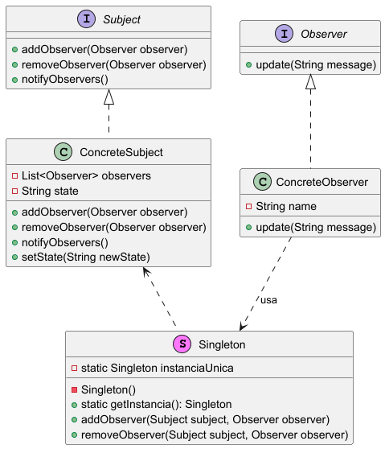
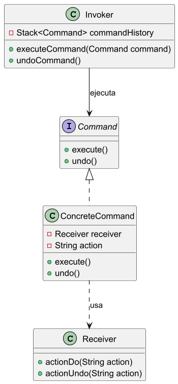

# Sprint 2: Diseño de la arquitectura

> *Los calcetines son como los sueños, a veces solo necesitas un par que te haga sentir bien*
**Dicho popular**
> 
- [x]  Diseño de la arquitectura general de la aplicación (estructura del código, módulos).
- [x]  Definición de la base de datos (tablas de clientes, facturas, locales).
- [x]  Bocetos de interfaces (UI/UX).

## Diseño de la arquitectura general de la Aplicación

### ¿Qué es **MVC (Modelo-Vista-Controlador)**?

El patrón **MVC** organiza la estructura de tu aplicación en tres componentes principales, lo que facilita el mantenimiento y la escalabilidad. Es ideal para aplicaciones que requieren una interfaz gráfica

- **Modelo**: Gestiona los datos y la lógica de negocio de la aplicación. Es la capa que representa los datos que necesita la aplicación, además de manejar su lógica.
    
    [Definición de la base de datos](Definicion_de_la_base_de_datos.md)
    
- **Vista**: Es la interfaz de usuario. En tu caso, se implementará en Java/Swing y permitirá a los usuarios interactuar con la aplicación, ver facturas, gestionar clientes, etc.
    
    [Bocetos de la Interfaz (UI/UX)](Bocetos_de_la_Interfaz_(UI_UX).md)
    
- **Controlador**: Actúa como intermediario entre la Vista y el Modelo, gestionando la lógica de la aplicación. Recibe las solicitudes de la Vista y decide cómo interactuar con el Modelo, actualizando las vistas cuando los datos cambian.


**Flujo y explicación de la imagen**: Cuando el usuario realiza una acción en la Vista (por ejemplo, cambiar imagen a gris), la Vista envía una solicitud al Controlador, el cual procesa la lógica y la interacción con el Modelo. Luego, la Vista se actualiza con los nuevos datos.

### Ejemplo básico de MVC

Supongamos que el usuario quiere **crear un cliente** en tu aplicación:

1. **Vista**: Un formulario en Java/Swing donde el usuario introduce los datos del cliente y hace clic en "Guardar".

```jsx
public void callbackBotonGuardarCliente(){
	controlador.peticionGuardarCliente();
}
```

1. **Controlador**: Recibe el evento "Guardar" de la Vista y recoge los datos introducidos. Luego, llama al Modelo para guardar estos datos en la base de datos.

```jsx
public void peticionpeticionGuardarCliente(){
	modelo.guardarCliente();
}
```

1. **Modelo**: Contiene la lógica para validar y guardar la información del cliente. Además avisa a los observadores que tiene para modificar cambios visibles.

```jsx
public void guardarCliente(){
	// Acciones para guardar Cliente
	notificarCambio();
}
```

El `notificarCambio();` contendrá un aviso de `guardadoExistoso();` a todos los observadores que tiene suscritos a esa parte de la interfaz. En la vista:

```jsx
public void guardadoExistoso(){
	refrescaVentana(); 
	// Hace lo que queramos, como lanzar una ventana de confirmacion
}
```

### ¿Qué es **DAO (Data Access Object)**?

**DAO** es un patrón de diseño para gestionar la interacción con la base de datos, encapsulando las operaciones de acceso a los datos. Cada **DAO** se encarga de una entidad de tu base de datos (como "Clientes" o "Facturas") y proporciona métodos específicos para interactuar con ella.

- **Función**: Facilita las operaciones CRUD (Crear, Leer, Actualizar, Eliminar) de la base de datos, manteniendo el código de acceso a datos separado del Modelo.
- **Ventaja**: Al tener una capa exclusiva para el acceso a la base de datos, puedes cambiar la implementación de almacenamiento sin afectar al resto de la aplicación.


Los compones que conforman el patrón son:

- **BusinessObject**: representa un objeto con la lógica de negocio.
- **DataAccessObject**: representa una capa de acceso a datos que oculta la fuente y los detalles técnicos para recuperar los datos.
- **TransferObject**: este es un objeto plano que implementa el patrón Data Transfer Object (DTO), el cual sirve para transmitir la información entre el DAO y el Business Service.
- **DataSource**: representa de forma abstracta la fuente de datos, la cual puede ser una base de datos, Webservices, LDAP, archivos de texto, etc.


El diagrama se interpreta de la siguiente manera:

1. El *BusinessObject* creo u obtiene una referencia al *DataAccessObject*.
2. El *BusinessObject* solicita información al *DataAccessObject*
    - El *DataAccessObject* solicita la información al *DataSource*
    - El *DataAccessObject* crea una instancia del TransferObject con los datos recuperados del *DataSource*
    - El *DataAccessObject* response con el *TransferObject* creado en los pasos anteriores.
3. El *BusinessObject* actualiza algún valor del *TransferObject*
    - Más actualizaciones
4. El *BusinessObject* solicita el guardado de los datos actualizados al *DataAccessObject*.
    - El *DataAccessObject* guarda los datos en el *DataSource*.

# Patrones Utilizados

## Patrón Observer

El **patrón Observer** es un patrón de diseño de comportamiento que se utiliza para establecer una relación de dependencia uno-a-muchos entre objetos, de forma que cuando un objeto cambia su estado, todos sus dependientes (observadores) son notificados y actualizados automáticamente.

### Conceptos clave:

1. **Sujeto (Subject):** Es el objeto que mantiene el estado y permite que otros objetos (observadores) se registren para recibir notificaciones de cambio.
2. **Observador (Observer):** Representa a los objetos que desean recibir actualizaciones cuando el sujeto cambia su estado.
3. **Notificación:** Cuando el estado del sujeto cambia, todos los observadores registrados son notificados del cambio.

### Implementación en Java

A continuación se muestra una implementación básica en Java del patrón Observer:

### 1. Interface `Observer`

Define un método para que los observadores reciban la notificación de cambio.

```java
interface Observer {
    void update(String message);
}
```

### 2. Interface `Subject`

Define métodos para agregar, eliminar y notificar observadores.

```java
interface Subject {
    void addObserver(Observer observer);
    void removeObserver(Observer observer);
    void notifyObservers();
}
```

### 3. Clase `ConcreteSubject`

Implementa la interfaz `Subject`, mantiene el estado y notifica a los observadores registrados cuando cambia.

```java
import java.util.ArrayList;
import java.util.List;

class ConcreteSubject implements Subject {
    private List<Observer> observers = new ArrayList<>();
    private String state;

    @Override
    public void addObserver(Observer observer) {
        observers.add(observer);
    }

    @Override
    public void removeObserver(Observer observer) {
        observers.remove(observer);
    }

    @Override
    public void notifyObservers() {
        for (Observer observer : observers) {
            observer.update(state);
        }
    }

    public void setState(String newState) {
        this.state = newState;
        notifyObservers(); // Notifica a los observadores del cambio de estado
    }
}
```

### 4. Clase `ConcreteObserver`

Implementa la interfaz `Observer` y actualiza su estado cuando recibe una notificación.

```java
class ConcreteObserver implements Observer {
    private String name;

    public ConcreteObserver(String name) {
        this.name = name;
    }

    @Override
    public void update(String message) {
        System.out.println(name + " recibió la actualización: " + message);
    }
}
```

### Diagrama de Clases en PlantUML

Este es el diagrama de clases para la implementación anterior:


Este código define el funcionamiento básico del patrón Observer en Java. La clase `ConcreteSubject` notifica a sus observadores cada vez que su estado cambia, y cada `ConcreteObserver` responde a las notificaciones. Los Objetos Concretos serán en nuestro caso el DAO y la Vista respectivamente.

## Patrón Singleton

El patrón **Singleton** es un patrón de diseño que asegura que una clase solo tenga una única instancia y proporciona un punto de acceso global a ella. Esto es útil cuando necesitas un único objeto que coordine acciones en todo tu sistema, como un objeto de configuración, conexión de base de datos, o administrador de logs.

### Pasos para Implementar el Patrón Singleton en Java

1. **Definir el Constructor como Privado**: Esto impide que otras clases puedan crear instancias directamente.
2. **Crear una Instancia Estática de la Clase**: Esto almacenará la única instancia que se necesita.
3. **Método Público Estático de Acceso a la Instancia**: Este método devuelve la instancia única y crea la instancia solo la primera vez que se llama.

### Ejemplo de Implementación en Java

```java
public class Singleton {
    // 1. Declarar una instancia privada y estática de la clase
    private static Singleton instanciaUnica;

    // 2. Constructor privado para evitar instancias externas
    private Singleton() {
        // Código de inicialización si es necesario
    }

    // 3. Método público y estático para obtener la instancia única
    public static Singleton getInstancia() {
        if (instanciaUnica == null) {  // Crear la instancia solo si no existe
            instanciaUnica = new Singleton();
        }
        return instanciaUnica;  // Devolver la instancia única
    }

    // Método de ejemplo para demostrar el funcionamiento del Singleton
    public void mostrarMensaje() {
        System.out.println("Singleton en acción: ¡instancia única!");
    }
}
```

### Explicación

- **Singleton instanciaUnica**: Esta es la variable que almacenará la única instancia de la clase.
- **Singleton()**: El constructor privado impide que se creen instancias desde fuera de la clase.
- **getInstancia()**: Este método verifica si `instanciaUnica` ya existe. Si no, crea una nueva instancia y la devuelve; si ya existe, solo la devuelve.

### Uso del Singleton en otra Clase

```java
java
public class Main {
    public static void main(String[] args) {
        // Accediendo a la instancia del Singleton
        Singleton singleton = Singleton.getInstancia();
        singleton.mostrarMensaje();
    }
}
```

### Diagrama de Clases (UML)

Aquí tienes el código en formato PlantUML para visualizar el diagrama:


### Explicación del Diagrama

- `Singleton` tiene un método `getInstancia` que controla la creación y acceso a la instancia.
- `Main` utiliza `Singleton` llamando al método `getInstancia` para obtener la única instancia y luego ejecutar un método sobre ella (`mostrarMensaje`).

Este diseño asegura que `Singleton` solo tendrá una instancia única en toda la aplicación.

En nuestro caso, va a ser utilizado para gestionar las suscripciones y eliminaciones de Observadores en sus Observables.

## Observer+Singleton

Se da un esquema muy general del flujo con estos dos patrones vistos hasta el momento.



En esta estructura:

- **Singleton** actúa como un punto central para la suscripción y eliminación de observadores, pero solo llama a `addObserver` o `removeObserver` en cada `ConcreteSubject`.
- **ConcreteSubject** sigue siendo responsable de almacenar y gestionar su propia lista de observadores, manteniendo la lógica de notificación dentro de cada sujeto observable.

### Ventajas de Este Enfoque

1. **Separación de Responsabilidades**: El `Singleton` solo administra el flujo de suscripción global, mientras que cada `ConcreteSubject` se encarga de su propia lista de observadores.
2. **Menor Acoplamiento**: Los observadores únicamente necesitan conocer al Observable al que se va a suscribir, pero no cómo funciona, sino sólo quién es. Por otra parte, el Observable no conocerá quién estará suscrito a su lista de Observadores. La lógica de notificación permanece en cada `ConcreteSubject`.
3. **Flexibilidad y Escalabilidad**: Si hay múltiples `ConcreteSubject`, cada uno puede gestionar sus propias listas sin interferencias, haciendo que el patrón sea más flexible.

### Implementación en Java de Este Enfoque

### 1. Interfaz `Observer`

No cambia de la versión anterior.

```java
interface Observer {
    void update(String message);
}
```

### 2. Interfaz `Subject`

Define métodos para agregar y eliminar observadores, así como para notificar cambios.

```java
interface Subject {
    void addObserver(Observer observer);
    void removeObserver(Observer observer);
    void notifyObservers();
}
```

### 3. Clase `ConcreteSubject`

Cada `ConcreteSubject` administra su propia lista de observadores. Al cambiar el estado, notifica a los observadores registrados.

```java
import java.util.ArrayList;
import java.util.List;

class ConcreteSubject implements Subject {
    private List<Observer> observers = new ArrayList<>();
    private String state;

    @Override
    public void addObserver(Observer observer) {
        observers.add(observer);
    }

    @Override
    public void removeObserver(Observer observer) {
        observers.remove(observer);
    }

    @Override
    public void notifyObservers() {
        for (Observer observer : observers) {
            observer.update(state);
        }
    }

    public void setState(String newState) {
        this.state = newState;
        notifyObservers();
    }
}
```

### 4. Clase `Singleton`

El `Singleton` actúa como un intermediario. Facilita la suscripción y eliminación de observadores en diferentes `ConcreteSubject`, pero no almacena los observadores.

```jsx
class Singleton {
    private static Singleton instanciaUnica = null;

    private Singleton() {}

    public static Singleton getInstancia() {
        if (instanciaUnica == null) {
            instanciaUnica = new ObserverManager();
        }
        return instanciaUnica;
    }

    public void addObserver(Subject subject, Observer observer) {
        subject.addObserver(observer);
    }

    public void removeObserver(Subject subject, Observer observer) {
        subject.removeObserver(observer);
    }
}
```

**Descripción**:

- `Singleton` tiene métodos `addObserver` y `removeObserver` que actúan como intermediarios. No mantiene una lista propia de observadores.
- Estos métodos llaman a `addObserver` y `removeObserver` en cada `ConcreteSubject`, delegando el almacenamiento y notificación de observadores a cada `ConcreteSubject`.

### 5. Clase `ConcreteObserver`

Implementa el método `update` y se registra en el `ConcreteSubject` a través del `Singleton`

```java
class ConcreteObserver implements Observer {
    private String name;

    public ConcreteObserver(String name, Subject subject) {
        this.name = name;
        Singleton.getInstancia().addObserver(subject, this); // Se suscribe usando ObserverManager
    }

    @Override
    public void update(String message) {
        System.out.println(name + " recibió la actualización: " + message);
    }
}
```

**Descripción**:

- `ConcreteObserver` se suscribe a `ConcreteSubject` a través de `Singleton`.
- Implementa el método `update`, que es llamado cuando el `ConcreteSubject` notifica un cambio.

### Explicación de la Combinación de Singleton y Observer

1. **Función del `Singleton`**:
    - `Singleton`facilita el proceso de suscripción y eliminación de observadores en cada `ConcreteSubject`.
    - No almacena los observadores, sino que llama a los métodos `addObserver` y `removeObserver` en cada `ConcreteSubject`.
2. **Responsabilidad de Notificación en `ConcreteSubject`**:
    - Cada `ConcreteSubject` mantiene su propia lista de observadores, garantizando que solo los observadores relevantes reciban las notificaciones.
    - `ConcreteSubject` maneja la lógica de notificación, evitando dependencias innecesarias en el `Singleton` para la gestión de suscriptores específicos.
3. **Desacoplamiento**:
    - `ConcreteObserver` solo interactúa con el `Singleton` para suscribirse, manteniendo un bajo acoplamiento.
    - Los `ConcreteSubject` pueden actuar independientemente y administrar sus propios observadores, facilitando la gestión de múltiples sujetos en la misma aplicación.

### Conclusión

En este enfoque, el patrón **Singleton** solo facilita las suscripciones, delegando la responsabilidad de la notificación a cada `ConcreteSubject`. Esto hace que el sistema sea más flexible, distribuido y escalable, y permite que cada `ConcreteSubject` gestione sus propios observadores sin duplicar almacenamiento o lógica en el `Singleton`.

## Deshacer/Rehacer acciones

La forma en que se gestiona el proceso de deshacer es mediante objetos orden que encapsulan la acción a realizar. Así el paso 2 se descompone en dos pasos:
2a) El controlador toma el requerimiento de la vista y lo interpreta. En este caso, no llama directamente al modelo para que realice las tareas sino que crea un objeto orden y encapsula dentro de él el receptor de la orden (el modelo), la tarea a realizar y la información necesaria para deshacerla si fuera necesario.
2b) Luego, pide a la orden que se ejecute y la propia orden es quien llama al modelo para que realice la acción.


Al ser objetos, las órdenes se pueden almacenar el pilas, su comportamiento puede repetirse y desde fuera se ven con una API uniforme, por lo que el proceso de deshacer se simplifica muchísimo. De nuevo las órdenes se programan mediante patrones de diseño.

## Patrón Orden (Command)

El patrón **Command (Orden)** es un patrón de diseño que encapsula una solicitud como un objeto, lo que permite parametrizar otros objetos con diferentes solicitudes, deshacer operaciones y mantener un historial de acciones. Es especialmente útil para implementar **acciones reversibles** y **colas de comandos**.

### Elementos del Patrón Command

1. **Command (Interfaz)**: Define un método `execute()` y opcionalmente `undo()` para ejecutar y deshacer una acción.
2. **ConcreteCommand**: Implementa la interfaz `Command`, encapsulando la lógica para realizar y deshacer una acción específica.
3. **Receiver**: La clase que realiza el trabajo real cuando un `ConcreteCommand` se ejecuta.
4. **Invoker**: Maneja los objetos `Command` y los ejecuta. Puede guardar comandos para deshacer o rehacer acciones.

### Implementación en Java

### 1. Interfaz `Command`

Define los métodos `execute()` y `undo()`.

```java
interface Command {
    void execute();
    void undo();
}
```

### 2. Clase `Receiver`

Realiza el trabajo real solicitado por los comandos.

```java
class Receiver {
    public void actionDo(String action) {
        System.out.println("Realizando: " + action);
    }

    public void actionUndo(String action) {
        System.out.println("Deshaciendo: " + action);
    }
}
```

### 3. Clase `ConcreteCommand`

Implementa la interfaz `Command`, encapsulando acciones específicas.

```java
class ConcreteCommand implements Command {
    private Receiver receiver;
    private String action;

    public ConcreteCommand(Receiver receiver, String action) {
        this.receiver = receiver;
        this.action = action;
    }

    @Override
    public void execute() {
        receiver.actionDo(action);
    }

    @Override
    public void undo() {
        receiver.actionUndo(action);
    }
}
```

### 4. Clase `Invoker`

Es responsable de ejecutar y deshacer comandos. Puede mantener un historial de comandos ejecutados.

```java
import java.util.Stack;

class Invoker {
    private Stack<Command> commandHistory = new Stack<>();

    public void executeCommand(Command command) {
        command.execute();
        commandHistory.push(command);
    }

    public void undoCommand() {
        if (!commandHistory.isEmpty()) {
            Command lastCommand = commandHistory.pop();
            lastCommand.undo();
        } else {
            System.out.println("Nada que deshacer.");
        }
    }
}
```

### Diagrama en PlantUML



### Resumen

1. **Command** encapsula una solicitud (`execute`) y su reversión (`undo`).
2. **Invoker** centraliza la ejecución y deshacer de comandos.
3. **Receiver** realiza el trabajo real asociado con los comandos.
4. **ConcreteCommand** actúa como intermediario entre el `Invoker` y el `Receiver`.

Con esta estructura, puedes implementar acciones reversibles y mantener un historial de comandos para deshacerlas en tu aplicación.

## Aplicación del Diseño de arquitectura

Ahora, al comprender cada uno de los elementos introducidos iremos viendo poco a poco como se va formando nuestra arquitectura personal en la Aplicación extrapolando todas las piezas anteriores

### Modelo

Conservarán las clases Usarias de los Objetos que tengo que manejar


## Controlador

Para cada uno de los DAO que relacionan el Modelo con la propia clase. Además se añade un controlador extra para el fichero de preferencias que tendré que escribir


### Vista

Todas las interfaces y cómo se van a relacionar entre ellas para la visualización de la App


### DAO

Relación directa con la BBDD. Alternamente, y sin entrar en detalle, deberé de crear una clase externa que conecte conla BBDD llamada `FirebaseInitializer`. No la pongo dentro del esquema para no sobrecargarlo demasiado


### Observer

Entran en juego los patrones explicados, dando la máxima importancia al patrón Observer con sus muchos Observadores que notificarán a la/s vista/s correspondiente/s los cambios que debe mostrar al cambiar la estrucutra lógica en el Modelo


### Comando

El 2º patrón que lleva gran peso de la comunicación entre Controlador y DAO para encapsular las órdenes y ejecutarlas, deshacerlas o rehacerlas según la Pila de Cambios.


## Unión entre Paquetes y Patrones

En resumidas cuentas, nos podemos hacer una idea muy general de que, en definitiva, la estructura de la aplicación interna y cómo funcionará el flujo de datos y notificaciones quedará del siguiente modo


Se incluye, no explicado anteriormente

- El Singleton `GestorObserver` : encargado de manipular las suscripciones y altas de los observadores en los observables
- El Singleton `PilaDeshacer` : el UndoManager de JavaSwing que nos permitirá de forma eficaz llevar a cabo la inclusión del Patrón Command
- La Interfaz `Observable` : ya comentada en su respectiva explicación, dado que las clases DAO serán quienes contendrán a los Observadores y notificarán los cambios.